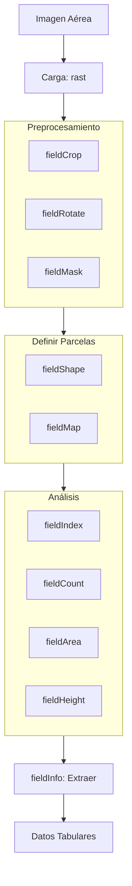

# 00. Introducción a FIELDimageR

## ¿Qué es FIELDimageR?

**FIELDimageR** es un paquete de R para analizar imágenes ortomosaicas de ensayos agrícolas. Permite extraer datos cuantitativos de imágenes capturadas por drones o cámaras aéreas sobre campos experimentales.

### Aplicaciones principales

- Fenotipado de alto rendimiento
- Conteo de plantas (stand count)
- Medición de cobertura vegetal
- Cálculo de índices de vegetación (NDVI, NGRDI, etc.)
- Estimación de altura y biomasa
- Análisis temporal de cultivos

---

## Conceptos Clave

### 1. Ortomosaico
Imagen georeferenciada formada al unir múltiples fotografías aéreas. Representa una vista ortogonal (desde arriba) del campo.

### 2. Parcela Experimental
Unidad básica de análisis. Área rectangular donde se evalúa un tratamiento o genotipo específico.

### 3. Shapefile
Archivo vectorial que define los límites de cada parcela. Permite extraer datos específicos por parcela.

### 4. Índice de Vegetación
Cálculo matemático usando bandas espectrales para cuantificar características de la vegetación (verdor, vigor, estrés).

---

## Arquitectura del Paquete

### Flujo de trabajo típico

1. **Cargar imagen** → `terra::rast()`
2. **Preprocesar** → `fieldCrop()`, `fieldRotate()`, `fieldMask()`
3. **Definir parcelas** → `fieldShape()`, `fieldMap()`
4. **Calcular índices** → `fieldIndex()`
5. **Extraer datos** → `fieldInfo()`
6. **Exportar resultados** → CSV, shapefiles

---

## Tipos de Imágenes Soportadas

| Tipo | Bandas | Ejemplo de Uso |
|------|--------|----------------|
| RGB | 3 (Rojo, Verde, Azul) | Análisis básico de color y cobertura |
| Multiespectral | 5-10 (RGB + RedEdge + NIR) | NDVI, NDRE, análisis de salud |
| Hiperespectral | 100+ bandas | Firmas espectrales detalladas |
| DSM | 1 banda (elevación) | Altura de plantas, biomasa |

---

## Dependencias Principales

- **terra**: Manejo de rasters (nueva generación)
- **raster**: Operaciones raster (legacy)
- **sf/sp**: Datos vectoriales (shapefiles)
- **EBImage**: Procesamiento de imágenes
- **dplyr**: Manipulación de datos

---

## Ventajas de FIELDimageR

✅ Diseñado específicamente para ensayos agrícolas  
✅ Pipeline completo desde imagen cruda hasta datos  
✅ Soporte para RGB y multiespectral  
✅ Automatización de tareas repetitivas  
✅ Compatible con OpenDroneMap  
✅ Código abierto y gratuito  

---

## Limitaciones

⚠️ Requiere imágenes de buena calidad y resolución  
⚠️ Parcelas deben ser relativamente rectangulares  
⚠️ Alto consumo de memoria con imágenes grandes  
⚠️ Curva de aprendizaje en R  

---

## Próximos Pasos

Continúa con:
- **[01. Instalación](01_instalacion.md)** - Configurar tu entorno
- **[02. Carga y Visualización](02_carga_visualizacion.md)** - Primeros pasos prácticos

---

[⬅️ Volver al índice](README.md)

